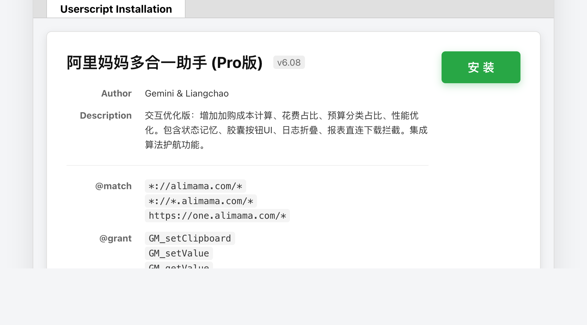
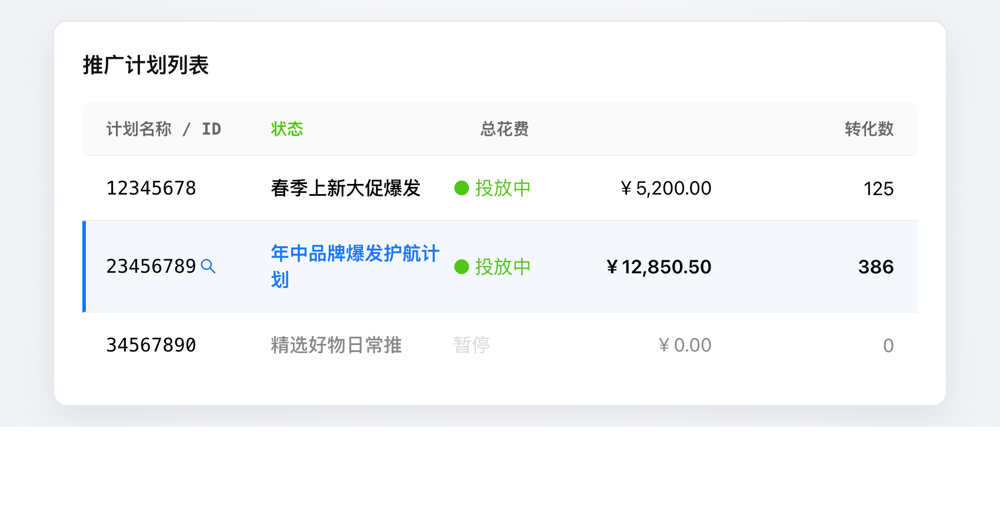

# 阿里妈妈多合一助手 Pro — 新人使用教程

> 本教程面向第一次使用「阿里妈妈多合一助手 Pro」的用户，从安装到日常操作一步步带你上手。

---

## 目录

- [一、安装指南](#一安装指南)
  - [方式 A：Tampermonkey 安装（推荐）](#方式-atampermonkey-安装推荐)
  - [方式 B：Chrome / Edge 插件安装](#方式-bchrome--edge-插件安装)
- [二、初次打开 — 认识主面板](#二初次打开--认识主面板)
- [三、四大核心功能详解](#三四大核心功能详解)
  - [1. 算法护航](#1-算法护航)
  - [2. 组建计划](#2-组建计划)
  - [3. 万能查数](#3-万能查数)
  - [4. 辅助显示](#4-辅助显示)
- [四、辅助显示开关详解](#四辅助显示开关详解)
- [五、其他实用功能](#五其他实用功能)
- [六、常见问题 FAQ](#六常见问题-faq)

---

## 一、安装指南

### 方式 A：Tampermonkey 安装（推荐）

适合大部分用户，安装简单、自动更新。

**第 1 步：安装 Tampermonkey 浏览器扩展**

1. 打开 Chrome 网上应用店（或 Edge 附加组件商店）
2. 搜索 **Tampermonkey**，点击安装
3. 安装完成后，浏览器右上角会出现一个黑色方块图标

**第 2 步：安装助手脚本**

1. 点击下方链接安装脚本：

   ```
   https://github.com/huron09280/alimama-helper-pro/releases/latest/download/alimama-helper-pro.user.js
   ```

2. Tampermonkey 会弹出安装确认页面，点击 **「安装」** 即可：

   

3. 安装成功后，访问阿里妈妈页面，脚本自动生效

> 💡 **自动更新**：脚本会定期检测新版本并提示更新。如果没有收到更新提示，可以手动打开 `.meta.js` 地址触发检查。

### 方式 B：Chrome / Edge 插件安装

适合不方便使用 Tampermonkey 的环境。

1. 前往 [GitHub Releases 页面](https://github.com/huron09280/alimama-helper-pro/releases/latest)，下载 `alimama-helper-pro-extension.zip`
2. 解压到本地任意文件夹
3. 打开浏览器 → 地址栏输入 `chrome://extensions/`（Edge 则输入 `edge://extensions/`）
4. 右上角开启 **「开发者模式」**
5. 点击 **「加载已解压的扩展程序」**，选择刚才解压的文件夹
6. 访问阿里妈妈页面，插件自动生效

> ⚠️ **注意**：Tampermonkey 和插件方式 **只需选一个**，不要同时启用，否则脚本会重复执行。

---

## 二、初次打开 — 认识主面板

安装完成后，打开阿里妈妈投放后台（`https://one.alimama.com/...`），你会在页面 **右上角** 看到一个蓝色闪电 ⚡ 悬浮球。

### 悬浮球

悬浮球是助手的最小化状态，位于页面右上角，随时可以点击或悬停展开面板：


### 主面板

鼠标移入悬浮球或点击它，即可展开主面板。面板采用毛玻璃（glassmorphism）设计风格，包含四大工具按钮和运行日志：


**面板布局说明**：

```
┌─────────────────────────────┐
│ ⚡ 阿里助手 Pro   v6.08  ✕ │  ← 标题栏（显示版本号）
├─────────────────────────────┤
│ 🔧 算法护航    📋 组建计划 │  ← 工具按钮区（2×2 网格）
│ 📊 万能查数    👁 辅助显示 │
├─────────────────────────────┤
│ 📋 运行日志    清空 | 展开  │  ← 日志区
└─────────────────────────────┘
```

**基本交互**：

| 操作 | 效果 |
|------|------|
| 鼠标移入悬浮球 | 自动展开主面板 |
| 点击悬浮球 | 强制展开主面板 |
| 鼠标移出面板 | 自动最小化 |
| 点击 ✕ 按钮 | 最小化面板 |
| 拖拽面板左边缘 | 调整面板宽度（250px ~ 500px） |

---

## 三、四大核心功能详解

### 1. 算法护航

**用途**：对投放计划进行算法优化护航。

**操作步骤**：

1. 点击主面板中的 **「算法护航」** 按钮
2. 主面板会自动最小化，弹出算法护航窗口（居中显示）
3. 在窗口中配置护航参数，确认后执行
4. 执行过程和结果会在护航窗口中实时展示

> 💡 **提示**：算法护航窗口会居中显示，支持滚动查看完整内容。

### 2. 组建计划

**用途**：通过向导界面批量创建投放计划，支持关键词推广和人群推广。

**操作步骤**：

1. 点击主面板中的 **「组建计划」** 按钮
2. 打开向导界面，按照以下流程操作：
   - **选择商品**：搜索并选择要推广的商品
   - **选择场景**：选择推广场景（关键词推广 / 人群推广 / 全站推广等）
   - **配置策略**：设置出价方式、推广目标、预算等
   - **预览提交**：确认计划内容，提交创建
3. 支持矩阵维度组合、批量生成多条差异化计划

**进阶功能**：

- **矩阵维度**：在策略配置中可以添加矩阵维度（如多种出价、多种预算），自动交叉组合生成多计划
- **场景切换**：支持在多个推广场景之间快速切换配置
- **草稿恢复**：向导状态会自动暂存，关闭后再打开可恢复上次配置

### 3. 万能查数

**用途**：快速查询投放数据，支持多维度分析和人群看板。

**打开方式（两种）**：

- **方式一**：点击主面板中的 **「万能查数」** 按钮
- **方式二**：在投放列表中，每条计划 ID 旁会出现一个 🔍 小图标，点击即可直接查询该计划数据

**快捷入口示意**：

助手会自动扫描页面上的计划 ID，并在每个 ID 旁注入 🔍 查询图标。鼠标悬停计划所在行时图标自动显示，点击后自动填入计划 ID 并提交查询：



**操作步骤**：

1. 在万能查数弹窗中输入查询条件（计划 ID、时间范围、维度等）
2. 支持多维度对比：日期/小时/地域/人群等
3. 人群看板支持悬停查看指标详情

### 4. 辅助显示

**用途**：在投放列表页注入额外的指标列和交互增强功能。

**操作步骤**：

1. 点击主面板中的 **「辅助显示」** 按钮
2. 展开辅助显示子面板，显示 8 个功能开关
3. 根据需要开启/关闭对应开关（蓝色亮点 = 已开启，灰色 = 已关闭）
4. 开关状态会自动记忆，下次打开浏览器仍然保持


---

## 四、辅助显示开关详解

| 开关名称 | 功能说明 |
|----------|---------|
| **询单成本** | 在投放列表中新增「询单成本」列，自动计算花费 ÷ 询单量 |
| **加购成本** | 新增「加购成本」列，自动计算花费 ÷ 加购量 |
| **潜客占比** | 显示潜客（新客等）占比数据 |
| **花费占比** | 显示每条计划的花费占总花费的百分比 |
| **预算进度** | 显示预算消耗进度（当前花费 / 日预算） |
| **预算破限** | 绕过前端预算输入限制，允许设置超出默认上限的预算值 |
| **花费排序** | 自动按花费从高到低排序投放列表 |
| **计划并发** | 在计划 ID 旁显示「并发开启」按钮，可一键批量启动多条计划 |

> 💡 每个开关都可以独立开启/关闭，互不影响。开关状态会通过浏览器持久化存储，刷新或重开浏览器后仍然保持。

---

## 五、其他实用功能

### 下载拦截 & 报表直链

当你在阿里妈妈页面操作报表下载时，助手会自动拦截下载链接，并在页面右下角弹出一个下载面板：


- **下载文件**：直接下载报表文件
- **复制链接**：复制报表直链到剪贴板

这样可以避免某些场景下载不成功的问题，也方便分享报表链接。

### 潜力词日维度导出

在投放列表页的工具栏区域，会出现「导出潜力词」按钮：

1. 设置要导出的天数范围
2. 点击导出，自动生成 CSV 文件下载

### 运行日志

主面板底部的「运行日志」区域记录了助手的所有操作日志：

- 点击 **「展开」** 查看日志详情
- 点击 **「清空」** 清除历史日志
- 日志默认折叠，不占用视觉空间

---

## 六、常见问题 FAQ

### Q1：安装后页面上没有看到悬浮球？

**排查步骤**：

1. 确认当前页面是阿里妈妈域名（`alimama.com` 或 `one.alimama.com`）
2. 在 Tampermonkey 面板中确认脚本已启用（绿色开关打开）
3. 尝试刷新页面（Ctrl/Cmd + R）
4. 如果使用插件模式，检查扩展管理页中插件是否已启用

### Q2：页面版本号与最新版不一致？

检查三个位置是否同步：
- Tampermonkey 脚本头部 `@version`
- 主面板标题栏显示的版本号
- GitHub Releases 页面的最新版本

如果不一致，手动打开 `.meta.js` 地址触发更新检查。

### Q3：算法护航按钮点击后提示"模块初始化中"？

这通常是脚本刚加载、模块尚未完成初始化导致的。等待 1~2 秒后会自动重试，如果仍然失败请刷新页面。

### Q4：万能查数弹窗无法打开？

1. 检查页面是否完全加载完成
2. 尝试等待 2~3 秒后重新点击
3. 如果仍然无法打开，刷新页面后重试

### Q5：Tampermonkey 和插件能同时装吗？

**不建议**。同时启用会导致脚本重复注入，可能出现按钮事件失效、UI 重叠等问题。请只保留其中一种安装方式。

### Q6：辅助显示的开关状态会丢失吗？

不会。所有开关状态通过 `GM_setValue` / `GM_getValue`（Tampermonkey）或浏览器扩展存储持久化保存。除非你手动清除浏览器数据或卸载脚本，否则设置会一直保留。

### Q7：如何反馈问题或建议？

请在 GitHub 仓库的 [Issues 页面](https://github.com/huron09280/alimama-helper-pro/issues) 提交，附上以下信息：

- 浏览器版本
- 安装方式（Tampermonkey / 插件）
- 脚本版本号
- 问题截图或描述

---

## 快速上手总结

```
1. 安装 Tampermonkey → 安装脚本 → 打开阿里妈妈页面
2. 看到右上角 ⚡ 悬浮球，表示安装成功
3. 移入悬浮球 → 展开主面板
4. 根据需求点击四大工具按钮：
   - 算法护航：优化投放
   - 组建计划：批量建计划
   - 万能查数：数据分析
   - 辅助显示：增强投放列表
```

🎉 **现在你已经掌握了阿里妈妈多合一助手 Pro 的所有核心用法，赶快去试试吧！**
